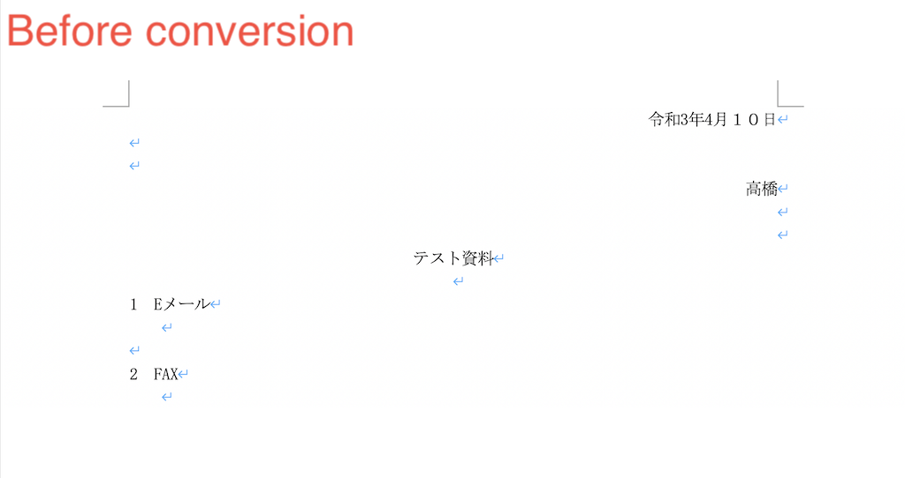
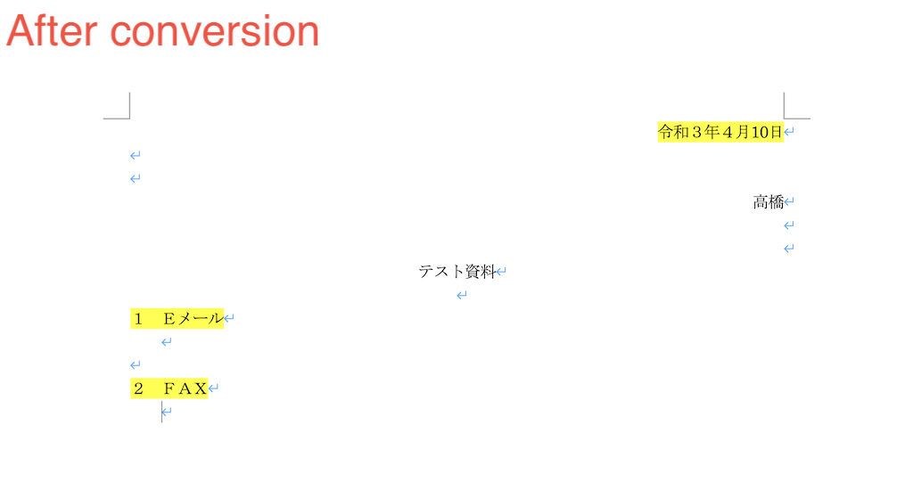

# python-word
This program converts a WORD file according to the rules below.

- A single half-size number to a full-size
- Consecutive full-size numbers to half-size
- Half-size English to full-size

<div align="center">
    
    
</div>

## Requirements
- python==3.8+
- [poetry](https://org-technology.com/posts/python-poetry.html)
## Setup
### Install packages via poetry
```
poetry install
```

### Data
Please make `data` folder and save `.docx` file.

### Run
Below is an example of program execution.
```
poetry run python convert.py -f data/test.docx
```
The converted file and the difference list will be saved in the same folder as the original file.
